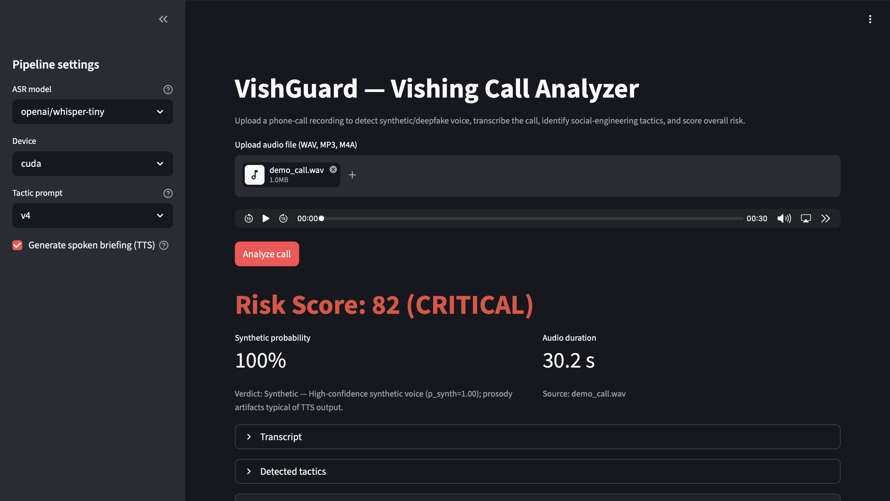

# VishGuard

**Demo video:** [vimeo.com/1187092533](https://vimeo.com/1187092533)

Vishing-risk audio pipeline for CS 5542 Quiz Challenge 2 (UMKC, Spring 2026).
Analyzes a phone-call recording and returns a structured risk report:
transcript, synthetic-voice likelihood, social-engineering tactic labels,
aggregate risk score with reasoning, and a spoken briefing via SpeechT5.

---

## Quick start

Requires **Python 3.12** (matches Colab 2026-04 runtime).

```bash
git clone <repo-url> && cd vishguard
python3.12 -m venv .venv && source .venv/bin/activate
pip install --upgrade pip
pip install -e .
pip install -r requirements.txt
pytest tests/           # 138 tests, all green
streamlit run app.py    # opens at http://localhost:8501
```

`bitsandbytes` is **not** in `requirements.txt` — it has no macOS build.
The 4-bit LLM quantization path only runs on Colab. Whisper, librosa,
SpeechT5, and the Streamlit UI all work CPU-only; use `whisper-tiny` for
demo speed locally.

### Environment variables (optional)

Copy `.env.example` and fill in any values you need:

```bash
cp .env.example .env
```

No API keys are required for the default open-source pipeline.
The `.env` file is gitignored.

---

## Streamlit UI

```bash
streamlit run app.py
```

1. Upload a WAV, MP3, or M4A recording.
2. Choose ASR model (`whisper-tiny` for CPU, `whisper-small` for accuracy).
3. Click **Analyze call** — results appear in 30–90 s on CPU for a 60 s clip.

The sidebar lets you toggle TTS briefing generation and select the tactic
prompt variant (v4 is the default; v1–v3 are retained for A/B comparison).



---

## CLI

```bash
# Full pipeline — writes report.json + briefing.wav to out/
vishguard run call.wav --out out/

# CPU-only local run — whisper-tiny, no TTS, no 4-bit LLM
vishguard run call.wav --out out/ --device cpu --whisper openai/whisper-tiny --no-tts

# Compare prompt variants (Phase 3 A/B eval)
vishguard run call.wav --out out/ --prompt v1
vishguard run call.wav --out out/ --prompt v4
```

---

## Model card

| Stage | Model | Size | License | Notes |
| --- | --- | --- | --- | --- |
| ASR | `openai/whisper-small` | 244 M | MIT | Primary; use `whisper-tiny` (39 M) for CPU demo |
| Anti-spoof | `mo-thecreator/Deepfake-audio-detection` | ~90 M | Apache 2.0 | Confirmed working T1.1; MelodyMachine alt always predicts real |
| Tactic LLM | `Qwen/Qwen2.5-3B-Instruct` | 3 B (fp16 / 4-bit) | Apache 2.0 | 10/10 JSON reliability on Colab T4; use fp16 on CPU |
| TTS | `microsoft/speecht5_tts` + HiFi-GAN | — | MIT | Bonus multimodal output; speaker index 7306 pinned |
| TTS speaker | `Matthijs/cmu-arctic-xvectors` | — | CC-BY | Speaker embedding for SpeechT5 |

Full model selection rationale: [`docs/ARCHITECTURE.md §2`](./docs/ARCHITECTURE.md).

---

## Evaluation results (Phase 3, Colab T4)

### Anti-spoof (T3.2)

| Subset | Accuracy | Precision | Recall | F1 | EER |
| --- | --- | --- | --- | --- | --- |
| LibriSpeech real (n=50) | 1.00 | — | — | — | — |
| SpeechT5 synthetic (n=50) | 0.66 | 1.00 | 0.66 | 0.795 | — |
| **Overall (n=100)** | **0.83** | **1.00** | **0.66** | **0.795** | **0.14** |

Confusion matrix: [`artifacts/plots/t3_2_antispoof_confusion_matrix.png`](./artifacts/plots/t3_2_antispoof_confusion_matrix.png)

### Tactic classifier macro-F1 by prompt variant (T3.4)

| Variant | Macro-F1 | Notes |
| --- | --- | --- |
| v1 — bare label list | 0.024 | Baseline; almost no signal |
| v2 — definitions + 3 few-shot | 0.454 | +43 points vs v1 |
| v3 — fixed impersonation def, 5-shot | 0.515 | +6 points |
| **v4 — 9-shot, co-occurrence fixes** | **0.604** | **Deployed default** |

Best per-label (v4): `benign`=1.0, `tech_support`=0.80, `financial_manipulation`=0.70.
Weakest: `fear_intimidation`=0.36, `impersonation`=0.40, `pretexting`=0.46.

Full per-label CSV: [`artifacts/reports/t3_4_tactic_metrics.csv`](./artifacts/reports/t3_4_tactic_metrics.csv)

### ASR WER (T3.5)

Both `whisper-tiny` and `whisper-small` produce mean WER ~1.89 on the
LibriSpeech T3.5 test set due to Whisper hallucination on short,
repeated clips. In-domain telephony speech (T1.3 spike) gave normalized
WER 0.013 (clean) and 0.032 (SNR 10 dB) — well within acceptable range.
See [`docs/FAILURES.md`](./docs/FAILURES.md) §3 for the hallucination analysis.

### End-to-end latency (T3.6, Colab T4, TTS disabled)

| Clip | Total | Ingestion | ASR | Anti-spoof | Tactics | Risk |
| --- | --- | --- | --- | --- | --- | --- |
| 15 s (cold start) | 33.9 s | 1.57 s | 11.9 s | 3.75 s | 11.1 s | 5.67 s |
| 45 s | 13.2 s | 0.007 s | 2.26 s | 2.66 s | 2.50 s | 5.72 s |
| 90 s | 17.9 s | 0.008 s | 2.24 s | 7.61 s | 2.49 s | 5.58 s |
| **Mean** | **21.7 s** | **0.53 s** | **5.47 s** | **4.68 s** | **5.35 s** | **5.66 s** |

The 15 s clip is dominated by model cold-start on first call. Subsequent
calls reuse the module-level model cache.

---

## Reproducing the evaluation

All eval scripts run on Colab via [`notebooks/04_phase3_eval.ipynb`](./notebooks/04_phase3_eval.ipynb).
To run locally (GPU recommended for LLM stage):

```bash
# T3.1 — build anti-spoof corpus (streams LibriSpeech + generates SpeechT5 samples)
python -m eval.buildSpoofSet --out eval/out/spoof/

# T3.2 — compute anti-spoof metrics
python -m eval.runSpoofEval --manifest eval/out/spoof/manifest.csv --out eval/out/spoof/

# T3.3 — validate tactic corpus
python -m eval.buildTacticSet --corpus eval/data/tactics.jsonl

# T3.4 — tactic classifier metrics across all prompt variants
python -m eval.runTacticEval --corpus eval/data/tactics.jsonl --out eval/out/tactics/

# T3.5 — ASR WER across models and SNR conditions
python -m eval.runAsrEval --out eval/out/asr/

# T3.6 — end-to-end latency bench
python -m eval.runLatencyBench --out eval/out/latency/
```

Artifact outputs (CSVs and plots) land in [`artifacts/`](./artifacts/).

---

## Sample output

A sample `report.json` from the architecture doc:

```json
{
  "version": "1.0.0",
  "audio": { "sourcePath": "call_01.wav", "durationSec": 47.2, "sampleRate": 16000 },
  "transcript": {
    "modelId": "openai/whisper-small",
    "languageCode": "en",
    "fullText": "Hello, this is calling from the IRS...",
    "segments": [{ "startSec": 0.0, "endSec": 4.1, "text": "Hello, this is calling from the IRS" }]
  },
  "spoof": { "pSynthetic": 0.87, "rationale": "High-confidence synthetic; prosody artifacts typical of TTS output." },
  "tactics": [
    { "label": "authority", "confidence": 0.93, "evidenceSpans": ["this is calling from the IRS"] },
    { "label": "fear_intimidation", "confidence": 0.88, "evidenceSpans": ["there is a warrant for your arrest"] },
    { "label": "financial_manipulation", "confidence": 0.81, "evidenceSpans": ["pay the $2400 in gift cards"] }
  ],
  "risk": { "score": 92, "band": "critical", "reasoning": "Block and report." },
  "timings": { "ingestion": 0.12, "asr": 8.4, "antiSpoof": 1.9, "tacticClassification": 4.3, "riskSynthesis": 2.1, "total": 20.6 }
}
```

---

## Project structure

```text
vishguard/
├── app.py                        # Streamlit UI entry point
├── requirements.txt              # CPU dependencies
├── requirements-gpu.txt          # Colab GPU additions (bitsandbytes)
├── configs/default.yaml          # default model/device config
├── src/vishguard/
│   ├── types.py                  # frozen dataclasses (shared types)
│   ├── loadAudio.py              # ingestion (librosa)
│   ├── asrWhisper.py             # ASR (Whisper direct, not pipeline)
│   ├── antiSpoof.py              # synthetic voice detection
│   ├── promptLibrary.py          # tactic + risk prompts (v1–v4)
│   ├── tacticClassifier.py       # LLM tactic stage (Qwen)
│   ├── riskSynthesis.py          # risk score formula + LLM reasoning
│   ├── briefingTts.py            # SpeechT5 spoken briefing
│   ├── orchestrator.py           # wires stages, times them
│   ├── reportSchema.py           # pydantic v2 JSON schema
│   ├── cli.py                    # batch CLI
│   └── ui/pageReport.py          # Streamlit render helpers
├── eval/                         # evaluation harness scripts
├── tests/                        # 138 unit tests (all green)
├── artifacts/                    # Phase 3 eval outputs (CSVs, plots)
├── notebooks/                    # Colab spike + eval notebooks
└── docs/                         # PRD, ARCHITECTURE, TASKS, AI_TOOLS
```

---

## AI tools disclosure

See [`docs/AI_TOOLS.md`](./docs/AI_TOOLS.md) — filled in after every session
per the CS 5542 rubric transparency requirement.

## License

Academic coursework. Models used under their respective HuggingFace licenses
(Apache 2.0 / MIT). See ARCHITECTURE.md §2 for per-model license details.
